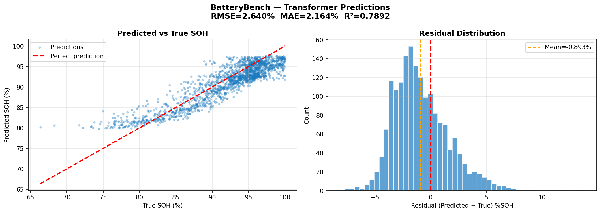

# 🔋 BatteryBench — Battery SOH Estimation

<p align="center">
  
</p>

<p align="center">
  
  
  
  
  
  
</p>

---

## Overview

BatteryBench is a Docker-based deep learning benchmark for lithium-ion battery State of Health (SOH) estimation. It compares CNN, LSTM, and Transformer architectures on the XJTU Battery dataset across 5 charge/discharge protocols.

**Key finding:** Transformer outperforms LSTM and CNN on short-sequence SOH regression — the opposite of bearing fault detection where LSTM wins on long sequences.

---

## Results

| Model | Val RMSE | Val MAE | Test RMSE | Test MAE | Test R² | Time |
|---|---|---|---|---|---|---|
| **Transformer** | **2.23%** | **1.66%** | **2.64%** | **2.16%** | **0.789** | 10 min |
| LSTM | 3.28% | 2.41% | 5.20% | 4.71% | 0.183 | 1.6 min |
| CNN | 4.49% | 3.67% | 5.69% | 5.04% | 0.019 | 2 min |

> **Key finding:** Transformer achieves R²=0.789 on unseen RW protocol (cross-protocol generalization). CNN and LSTM fail to predict low-SOH region due to training distribution mismatch — only Transformer's global attention captures the full degradation trend across 32 cycles.

---

## Cross-Project Benchmark

| Project | Dataset | Task | Best Model | Best Metric |
|---|---|---|---|---|
| CellSentinel | NASA PCoE | Fault Classification | CNN | 96% accuracy |
| BearingBench | XJTU Bearing | Fault Classification | LSTM | 96.6% accuracy |
| **BatteryBench** | **XJTU Battery** | **SOH Regression** | **Transformer** | **R²=0.789** |

**Pattern confirmed across 3 projects:**
```
Short sequences + small dataset  → Transformer wins
Long sequences  + large dataset  → LSTM wins  
Spatial patterns + any dataset   → CNN wins
```

---

## Dataset

**XJTU Battery Dataset** — 55 lithium-ion batteries (NCM 18650, 2000mAh)

| Batch | Protocol | Batteries | Cycles | Split | Notes |
|---|---|---|---|---|---|
| Batch-1 | 2C charge | 8 | ~390-420 | Train | Fast charge |
| Batch-2 | 3C charge | 15 | ~131-322 | Train | Aggressive charge |
| Batch-3 | R2.5Ω load | 8 | ~527-667 | Train | Resistive discharge |
| Batch-4 | R3Ω load | 8 | ~601-799 | Train | Resistive discharge |
| Batch-5 | Random Walk | 8 | ~186-340 | **Test** | Unseen protocol |
| Batch-6 | Satellite | 8 | ~908-1301 | **Excluded** | LEO partial cycles |

**Batch-6 exclusion rationale:** Simulates LEO satellite cycling (~95 min orbital period). Battery discharges 5-96% per orbit depending on eclipse duration — fundamentally different physics from EV/ground applications. SOH definition breaks down for partial cycles.

---

## SOH Definition

```
SOH = discharge_capacity_Ah[i] / max(discharge_capacity_Ah[:5]) × 100
      clipped to [0, 100]%

ref_cap = max of first 5 cycles (handles formation phase
          where capacity rises before degrading)
```

---

## Split Strategy — Cross-Protocol Generalization

```
Train : first 80% of cycles per battery · Batch-1 to 4
Val   : last  20% of cycles per battery · Batch-1 to 4
        (end-of-life region — SOH 67-91%)
Test  : ALL cycles · Batch-5 (RW — completely unseen protocol)

Why cross-protocol split:
  Different charge protocols produce different degradation curves
  Random split would leak protocol-specific patterns to test set
  → Inflated test scores that don't reflect real deployment
```

---

## Input Design

```
Features per cycle (9 summary features):
  discharge_capacity_Ah  charge_capacity_Ah
  discharge_power_Wh     charge_power_Wh
  charge_median_voltage  discharge_median_voltage
  charge_mean_voltage    discharge_mean_voltage
  cycle_norm             (cycle_number / total_cycles)

Sliding window : 32 cycles  (stride=1)
Input shape    :
  LSTM/Transformer : (batch, 32, 9)
  CNN              : (batch, 32, 9, 1)
Target         : SOH at last cycle of window
```

---

## Model Architectures

### Transformer (Best)
```
Input (32, 9)
  → Dense(32)          ← project to d_model=32
  → PositionalEncoding ← sine/cosine injection
  → [TransformerBlock × 2]
       MultiHeadAttention(4 heads, key_dim=8)
       Add & LayerNorm → FFN(64) → Add & LayerNorm
  → GlobalAveragePooling
  → Dense(64) → BN → Dropout(0.3)
  → Dense(32) → BN → Dropout(0.2)
  → Dense(1)  ← SOH prediction
```

### LSTM
```
Input (32, 9)
  → LSTM(64)  → BN → Dropout(0.3)
  → LSTM(32)  → BN → Dropout(0.2)
  → Dense(32) → BN → Dropout(0.2)
  → Dense(1)
```

### CNN
```
Input (32, 9, 1)
  → Conv2D(32,3×3) → BN → ReLU → Conv2D(32) → MaxPool → Dropout
  → Conv2D(64,3×3) → BN → ReLU → GlobalAvgPool → Dropout
  → Dense(64) → Dense(32) → Dense(1)
```

---

## Why CNN Fails for SOH

SOH estimation requires detecting the **global degradation trend** across all 32 cycles. CNN's 3×3 filters only see local 3-cycle × 3-feature patches — they miss the long-range capacity fade pattern. R²=0.019 means CNN essentially predicts the mean SOH regardless of input.

Transformer's self-attention directly compares cycle 1 to cycle 32, capturing the full degradation trajectory in a single attention operation.

---

## Docker Setup

### Prerequisites
- Docker Desktop with WSL2 integration
- NVIDIA GPU with Docker support
- XJTU Battery dataset

### Quick Start

```bash
git clone https://github.com/shamidou97/BatteryBench.git
cd BatteryBench

# Start MySQL
docker compose up -d mysql

# Run training (GPU)
docker compose run --rm trainer

# Start dashboard
docker compose up dashboard
# Open http://localhost:5001
```

### Dataset Setup

```bash
# Link XJTU dataset batches to data/
for i in 1 2 3 4 5; do
  ln -s /path/to/XJTU/dataset/Batch-$i trainer/data/Batch-$i
done
```

---

## Project Structure

```
BatteryBench/
├── docker-compose.yml
├── trainer/
│   ├── Dockerfile
│   ├── requirements.txt
│   └── src/
│       ├── battery_data_loader.py
│       ├── battery_trainer.py
│       └── bridge_to_sql.py
├── dashboard/
│   ├── Dockerfile
│   └── requirements.txt
├── mysql/
│   └── init/schema.sql
├── results/
│   ├── transformer_predictions.png
│   ├── lstm_predictions.png
│   ├── cnn_predictions.png
│   └── benchmark_report.txt
└── data/
    └── cache/
```

---

## MySQL Schema

```sql
DATABASE: batterybench (port 3307)

batches        ← 5 charge protocols
batteries      ← 47 batteries with metadata
cycles         ← 19,238 cycle records with SOH
model_results  ← benchmark results
```

---

## Citation

```bibtex
@dataset{xjtu_battery_2023,
  author    = {Wang, Fujin and others},
  title     = {A Novel Lithium-Ion Battery Pack Dataset for
               Battery Degradation Research},
  year      = {2023},
  publisher = {Xi'an Jiaotong University}
}
```

---

## Related Projects

| Project | Description | Link |
|---|---|---|
| CellSentinel | Li-ion Battery Fault Detection · CNN · 96% | [GitHub](https://github.com/shamidou97/CellSentinel) |
| BearingBench | Bearing Fault Detection · LSTM · 96.6% | [GitHub](https://github.com/shamidou97/BearingBench) |
| BatteryBench | Battery SOH Estimation · Transformer · R²=0.789 | This repo |

---

<p align="center">
Built with TensorFlow · Docker · XJTU Battery Dataset · RTX 4060 GPU · MySQL
</p>
